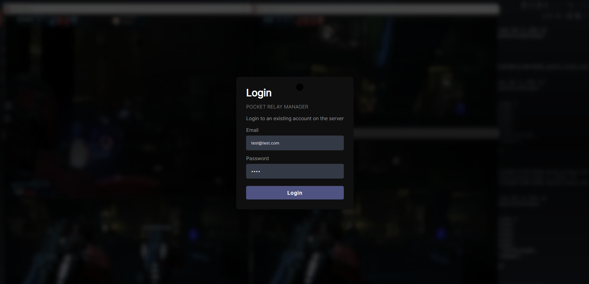
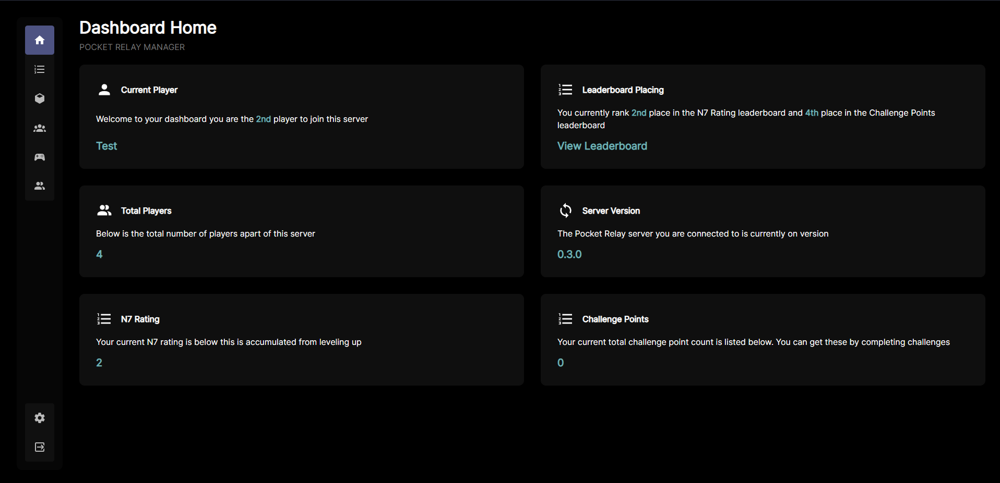
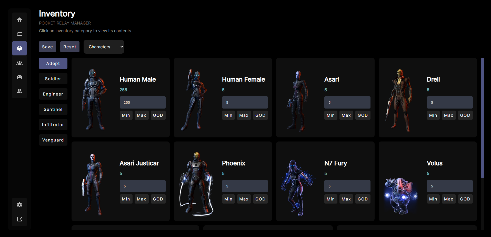

# Pocket Relay 

*Mass Effect 3 Server Emulator / Private Server*

[Discord Server (discord.gg/yvycWW8RgR)](https://discord.gg/yvycWW8RgR)
[Website (pocket-relay.pages.dev)](https://pocket-relay.pages.dev/)

> **📌 Update Notice**
> If you are updating from a version lower than 0.3 you will need to 
> delete the app.db file before launching or else the server will not
> work

**Pocket Relay** Is a custom implementation of the Mass Effect 3 multiplayer servers all bundled into a easy to use server with a Dashboard for managing accounts and inventories.

With **Pocket Relay** you can play Mass Effect 3 multiplayer offline by yourself, over LAN, or even over WAN as a public server 

## 📌 EA / BioWare Notice

The **Pocket Relay** software in all its forms are in no way or form supported, endorsed, or provided by BioWare or Electronic Arts. 

## 📖 Starting your own server

For guides check out the [Website (pocket-relay.pages.dev)](https://pocket-relay.pages.dev/) or refer directly to 
the [Server Setup Guide](https://pocket-relay.pages.dev/guide/server/)

## 📦 Downloads

Below is a table of the download links for the different platforms

| Platform | Download                                                                                                |
| -------- | ------------------------------------------------------------------------------------------------------- |
| Windows  | [Download](https://github.com/PocketRelay/Server/releases/latest/download/pocket-relay-windows.exe) |
| Linux    | [Download](https://github.com/PocketRelay/Server/releases/latest/download/pocket-relay-linux)       |

## 🔧 Configuration

In order to configure the server such as changing the ports you can see the
configuration documentation [Here (docs/CONFIG.md)](https://pocket-relay.pages.dev/guide/config/)

## ⚙️ Features

- **Origin Support** This server supports **Origin** / **EA Launcher** copies of the game through its fetching system. As long as the official servers are still available and you have internet access the server will connect to the official servers to authorize **Origin** accounts. *This behavior can be disabled using the `PR_ORIGIN_FETCH` environment variable*
- **Origin Fetching** Along with supporting **Origin** authentication your player data from the official servers can also be loaded for those logging into **Origin** accounts. *This behavior can be disabled using the `PR_ORIGIN_FETCH_DATA` environment variable*
- **Portable & Platform Independent** This server can be run on most hardware and software due to its low requirements and custom
implementations of lots of required portions allowing you to run it
on Windows, Linux, etc. *Note the server will store the player data and logging in a folder named `data` in the same folder as the exe*
- **Cracked Support** This server supports cracked Mass Effect 3 copies so you can play on the server using them.
- **Docker Support** This server includes a `Dockerfile` so that it can be run in a containerized environment. The server uses a small alpine linux container to run inside
- **Dashboard** The server includes a management dashboard 
    - This includes leaderboards displays
    - Allowing players to edit their username, email, and password
    - Deleting and managing accounts
    - Viewing running games
    - Inventory editing for admins (Weapons, Classes, Characters, etc)
    - View server logs as super admin

## 🚀 Manual Building

Instructions for building the server can be found [Here](https://pocket-relay.pages.dev/guide/server/building/)

> **Note**
> Building the server can be quite a heavy load on your computer

## Dashboard

Below are some screenshots of the included dashboard. You can access the dashboard by visting the server connection URL this 
URL will be present in the server logs / output upon launching.

> **Note**
> If you are running the server on the same computer you can access the dashboard using http://localhost

## ⛔️ Known Issues

**Host Migration** Host migration is partially working however it only currently works
for a single player. If there is more than one player in the game when host migration
occurs currently all the other players get booted from the game except for the new host.
This also causes the game to become un-joinable for other players.

> Host migration is a fixable issue it just needs more testing and experimenting

**Inital connection failure on menu when using cracked game** When connecting to the server
for the first time when you've originally logged into the official servers you will be given
a connection error screen. You can just press okay on this error this is because the server couldn't
authenticate you using a session token that was for the original server. Once you're on
the main menu you can push the button on the terminal or the "Multiplayer" button and you will be
taken to a login screen where you can create a new account with Pocket Relay.

> The only way to solve this issue would be to delete or move the Local_Profile.sav file
> whenever switching servers in order to clear the token.

**Account creation crash** Sometimes when attempting to create a new account the Mass Effect client
will crash. The cause for this is not yet known but restarting the game and attempting to create
an account again usually works.

## 🧾 License

MIT License

Copyright (c) 2022 - 2023 Jacobtread

Permission is hereby granted, free of charge, to any person obtaining a copy
of this software and associated documentation files (the "Software"), to deal
in the Software without restriction, including without limitation the rights
to use, copy, modify, merge, publish, distribute, sublicense, and/or sell
copies of the Software, and to permit persons to whom the Software is
furnished to do so, subject to the following conditions:

The above copyright notice and this permission notice shall be included in all
copies or substantial portions of the Software.

THE SOFTWARE IS PROVIDED "AS IS", WITHOUT WARRANTY OF ANY KIND, EXPRESS OR
IMPLIED, INCLUDING BUT NOT LIMITED TO THE WARRANTIES OF MERCHANTABILITY,
FITNESS FOR A PARTICULAR PURPOSE AND NONINFRINGEMENT. IN NO EVENT SHALL THE
AUTHORS OR COPYRIGHT HOLDERS BE LIABLE FOR ANY CLAIM, DAMAGES OR OTHER
LIABILITY, WHETHER IN AN ACTION OF CONTRACT, TORT OR OTHERWISE, ARISING FROM,
OUT OF OR IN CONNECTION WITH THE SOFTWARE OR THE USE OR OTHER DEALINGS IN THE
SOFTWARE.